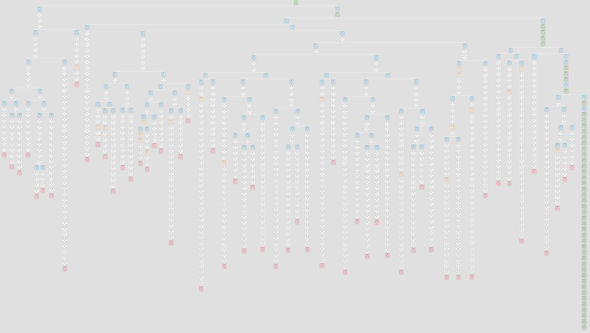

# Sudoku

A fast Sudoku solver written in C#. Can also act as a Sudoku generator.

## Console Application

Clone this repository as usual. From a terminal in the root of the repository `./run.sh` for macOS or `.\run.bat` for Windows. Then just follow the on screen prompts.

What to expect: https://www.youtube.com/watch?v=-XmEU7f3rpE

If there is only 1 puzzle to solve, it will display every evaluated step. Otherwise, it just shows each puzzle and its solution.

## Usage in Code

### Solving Sudokus

```csharp
var puzzle = new int[81];

/*
  Fill the array with the puzzle here. Use 0 to represent empty cells.
  
  Just flatten the puzzle into one long sequence,
  so puzzle[0..8] is the first row, puzzle[9..17] is second and so on.
*/

var solver = new Solver();

var result = solver.Solve(puzzle);
        
/*
  Output to console with a left offset of 1.
  Store cursor y position to draw puzzle and solution side by side.
*/

var y = Console.CursorTop;

puzzle.DumpToConsole(1, y);
        
result.Solution.DumpToConsole(30, y);

// The result has additional informational properties.

result.Steps; // How many steps were explored to find the answer.

result.Microseconds; // How long it took to solve.

/*
  There is an option to get the order in which the answer was found.
  This isn't generated by default for performance reasons.
*/

solver.Solve(puzzle, HistoryType.SolutionOnly);

foreach (var move in result.History)
{
    Console.WriteLine($"Row: {move.Y}    Column: {move.X}    Value: {move.Value}");        
}

/*
  Finally, there's an option to check whether the puzzle is a true Sudoku,
  that is, it only has 1 solution. Specify true as the third parameter
  to enable this (it is disabled by default for performance reasons).
*/

var result = solver.Solve(puzzle, HistoryType.SolutionOnly, true);

Console.WriteLine(result.Message);
```

Output:

```
 ┌───────┬───────┬───────┐    ┌───────┬───────┬───────┐
 │       │   2   │   9   │    │ 4 5 7 │ 8 2 6 │ 1 9 3 │
 │   6   │ 1     │       │    │ 9 6 3 │ 1 4 5 │ 2 8 7 │
 │     2 │ 7 3   │ 6     │    │ 8 1 2 │ 7 3 9 │ 6 5 4 │
 ├───────┼───────┼───────┤    ├───────┼───────┼───────┤
 │   3   │ 4     │ 8     │    │ 2 3 1 │ 4 5 7 │ 8 6 9 │
 │ 7 8   │ 6 9   │       │    │ 7 8 4 │ 6 9 1 │ 3 2 5 │
 │       │       │   4   │    │ 6 9 5 │ 2 8 3 │ 7 4 1 │
 ├───────┼───────┼───────┤    ├───────┼───────┼───────┤
 │     8 │       │       │    │ 1 7 8 │ 9 6 4 │ 5 3 2 │
 │     9 │       │   1   │    │ 5 2 9 │ 3 7 8 │ 4 1 6 │
 │       │ 5     │     8 │    │ 3 4 6 │ 5 1 2 │ 9 7 8 │
 └───────┴───────┴───────┘    └───────┴───────┴───────┘
```

### Generating Sudokus

```csharp
var generator = new Generator();

var puzzle = generator.Generate(50); // Will remove 60 cells, leaving a puzzle with 31 clues. Anything under ~28 clues can take a while.

puzzle.DumpToConsole(1);
```

Output:

```
 ┌───────┬───────┬───────┐
 │   6   │     4 │   2 8 │
 │       │   8 9 │     6 │
 │ 9 5   │       │       │
 ├───────┼───────┼───────┤
 │     5 │       │       │
 │ 6   4 │       │       │
 │ 8     │ 4 2   │   7 3 │
 ├───────┼───────┼───────┤
 │     6 │       │     7 │
 │       │       │ 4 8   │
 │       │       │       │
 └───────┴───────┴───────┘
```

## Screenshot


